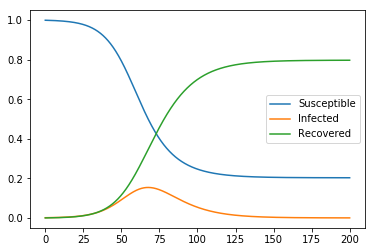
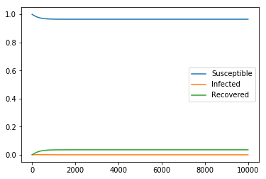
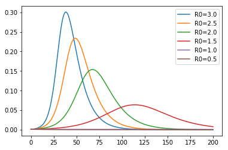
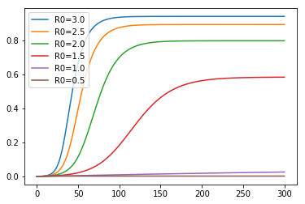

# 初めに
この記事は、もともとはQiitaにて公開していた記事をGithubにてアップしなおしたものです。昨今、新型コロナウイルスの流行に伴って感染症のニュースが話題になっており、基本再生産数や集団免疫などのワードがニュースでもたびたび出てくるようになりました。今回は、最も単純な感染症数理モデルであるSIRモデルを題材として、これらの概念について書いてみました。なお、当方は当該分野のプロではありません。そのため、誤り等があるかもしれませんが、そこはお許しください。また、誤りがある場合ご指摘をいただけると幸いです。

# SIRモデルとは
基本的には、以前書かせていただいた記事で紹介したSEIRモデルから潜伏期Eを除いて、さらに単純にしたものです。

 SIRモデルでは、すべての人口を次の集団に区分して、その時間発展を微分方程式で表現します。
- S(Susceptible):免疫がなく感染しうるもの
- I(Infected):感染症が発症しているもの
- R(Recovered):発症から回復し、免疫を得たもの

　各集団の説明を見ればわかるように、S→I→Rと順々に遷移していきます。その変化を微分方程式であらわすと、最も単純なモデルでは次の通り表すことができます。

$$
\begin{align}
\frac{dS}{dt}&=-\beta S I\newline
\frac{dI}{dt}&=\beta S I-\gamma I\newline
\frac{dR}{dt}&=\gamma I
\end{align}
$$
$$
\beta:感染率。\gamma:回復率
$$


# 流行が起きる条件と再生産係数
まず、上の式から時刻ゼロから状態を時間発展させたときに感染症の流行が起きる条件を見ていきます。流行が起きるためには、当然のことですが感染者数$I$が増加する必要があり、微分で書けば$dI/dt=(\beta S-\gamma)I$が時刻ゼロで正である必要があります。

ここからわかる流行の条件は以下の二つです。
- 感染者$I(0)>0$であること
- $\beta S(0)/\gamma>1$であること

一番目の条件は感染者が初めに存在する必要があるという、極々当たり前のことを言っているにすぎません。

二番目は一人の感染者が平均して発生させる二次感染者の数（これを実効再生産数$R_1=\beta S(0)/\gamma$といいます）が１より大きい必要があることを示しています。

そういう解釈が成立する理由としては、$\Delta I/I(0) =\beta S(0) \Delta t$より、開始時点の感染者$I(0)$が一人あたりに微小時間$\Delta t$の間に発生させる二次感染者は$\beta S(0) \Delta t$となり、この$\Delta t$を感染期間$1/\gamma$（感染者が単位時間あたり$\gamma I$だけ減少することから自明）にすれば、開始時点の感染者$I(0)$一人あたりに感染させた二次感染者の総数となるからです。
特に、感受性の集団（集団の皆が$S$の集団）に対する再生産数$R_0=\beta N/\gamma$を基本再生産数と呼びます。

なお、上に記載した条件を満たす場合、$t=0$の近傍では$I(t)=I(0)exp((\beta S-\gamma)t)$となり、指数関数的に感染拡大が進んでいきます。

# シミュレーション
人口のうち0.1%の感染者が存在する場合の数値計算を用いて、上で導いた結果が実際に起こることを確かめます。


```python
#include package
import numpy as np
from scipy.integrate import odeint
from scipy.optimize import minimize
import matplotlib.pyplot as plt
```


```python
#define differencial equation of sir model
def sir_eq(v,t,beta,gamma):
    return [-beta*v[0]*v[1],beta*v[0]*v[1]-gamma*v[1],gamma*v[1]]
```

## 流行が発生するケース（$R_0=2$)
まず、$\beta=0.2,\gamma=0.1$つまり$R_0=2$の場合についてみてみましょう。結果のグラフを見ると、人口の15%近くをピークとする流行が起こってることが確認できます。


```python
#solve sir model 1st case
ini_state=[0.999,0.001,0]
t_max=200
dt=0.01
t=np.arange(0,t_max,dt)
plt.plot(t,odeint(sir_eq,ini_state,t,args=(0.2,0.1)))
plt.legend(['Susceptible','Infected','Recovered'])
```


    <matplotlib.legend.Legend at 0x22a63b89b38>





## 流行が発生しないケース（$R_0=0.99$)
次に、$\beta=0.099,\gamma=0.1$つまり$R_0=0.99$の場合についてみてみましょう。この場合、時間をかなり長く取ってみても流行は起きていないことがわかります。


```python
#solve sir model 2nd case
ini_state=[0.999,0.001,0]
t_max=10000
dt=0.01
t=np.arange(0,t_max,dt)
plt.plot(t,odeint(sir_eq,ini_state,t,args=(0.099,0.1)))
plt.legend(['Susceptible','Infected','Recovered'])
```


    <matplotlib.legend.Legend at 0x22a63c5a390>





## 基本再生産数毎の感染者数の推移
さらに、基本再生産数$R_0$の値を変えたときの感染者$I$のグラフを見てみましょう。

$R_0$の値が大きいほど感染の拡大が急速に進み、急速に収束していくことが確認できます。


```python
#solve sir model about i
ini_state=[0.999,0.001,0]
t_max=200
dt=0.01
t=np.arange(0,t_max,dt)
plt.plot(t,odeint(sir_eq,ini_state,t,args=(0.30,0.1))[:,1])
plt.plot(t,odeint(sir_eq,ini_state,t,args=(0.25,0.1))[:,1])
plt.plot(t,odeint(sir_eq,ini_state,t,args=(0.20,0.1))[:,1])
plt.plot(t,odeint(sir_eq,ini_state,t,args=(0.15,0.1))[:,1])
plt.plot(t,odeint(sir_eq,ini_state,t,args=(0.10,0.1))[:,1])
plt.plot(t,odeint(sir_eq,ini_state,t,args=(0.05,0.1))[:,1])
plt.legend(['R0=3.0','R0=2.5','R0=2.0','R0=1.5','R0=1.0','R0=0.5'])
```


    <matplotlib.legend.Legend at 0x22a02b08f60>





## 基本再生産数毎の回復者数の推移
また、基本再生産数$R_0$を変えたときに最終的にどの程度の人間が感染するかを明らかにするべく、回復者$R$の数を見てみましょう。

当たり前のことではありますが、基本再生産者数$R_0$が少ないほど最終的な回復者の数（＝総感染者の数）は抑えられることがわかります。


```python
#solve sir model about r
ini_state=[0.999,0.001,0]
t_max=300
dt=0.01
t=np.arange(0,t_max,dt)
plt.plot(t,odeint(sir_eq,ini_state,t,args=(0.30,0.1))[:,2])
plt.plot(t,odeint(sir_eq,ini_state,t,args=(0.25,0.1))[:,2])
plt.plot(t,odeint(sir_eq,ini_state,t,args=(0.20,0.1))[:,2])
plt.plot(t,odeint(sir_eq,ini_state,t,args=(0.15,0.1))[:,2])
plt.plot(t,odeint(sir_eq,ini_state,t,args=(0.10,0.1))[:,2])
plt.plot(t,odeint(sir_eq,ini_state,t,args=(0.05,0.1))[:,2])
plt.legend(['R0=3.0','R0=2.5','R0=2.0','R0=1.5','R0=1.0','R0=0.5'])
```


    <matplotlib.legend.Legend at 0x22a02a018d0>





# 「封じ込め」と「集団免疫」のアプローチ
これまで書いていたように、感染症の流行を収束させるには、実効再生産数$R_1=\beta S(0)/\gamma$の値を1以下にする必要があります。

$\gamma$は感染症の感染期間の逆数でありコントロールすることができないと仮定すれば、取りうる戦略としてざっくり以下の二つになるかと思います。
- 人間の接触を避けて感染率$\beta$を下げる
- 集団の多くの者が一度感染するか、あるいはワクチンを利用することで、集団として免疫を有しない者$S(0)$を少なくする。この場合、免疫を所有する者の割合を$e$とすると、$e=1-\frac{1}{R_0}$以上になると感染症が収束します。

この二つが一時期イギリスの独自の戦略としてニュースになった「封じ込め」と「集団免疫」に対応するのでは、と考えています。https://news.tv-asahi.co.jp/news_society/articles/000179306.html

もちろん、実際は「集団免疫」の獲得を目指すとしても、今回の新型コロナウイルスのようなワクチンのない感染症の場合、「封じ込め」政策を取って実効再生産数$R_1$を抑えなければ、急速な感染拡大が起き医療キャパシティをオーバーすることで多数の犠牲が生じることとなります。そのため、これらの戦略は独立したものではなく、「封じ込め」を長期にわたって行った結果として、最終的には「集団免疫」が獲得されるといった関係かと思います。

# 終わりに
今回は最も単純なモデルであるSIRモデルを用いて、基本再生産数を主に紹介させていただきました。新型コロナ感染症の話題はニュースでも話題なこともあり、ここに書いてある程度のことはとっくに知っているよという方も多そうで恐縮なところではありますが、何かしら参考としていただける方がいれば幸いに思います。

# 参考資料
稲葉寿　編著「感染症の数理モデル」
